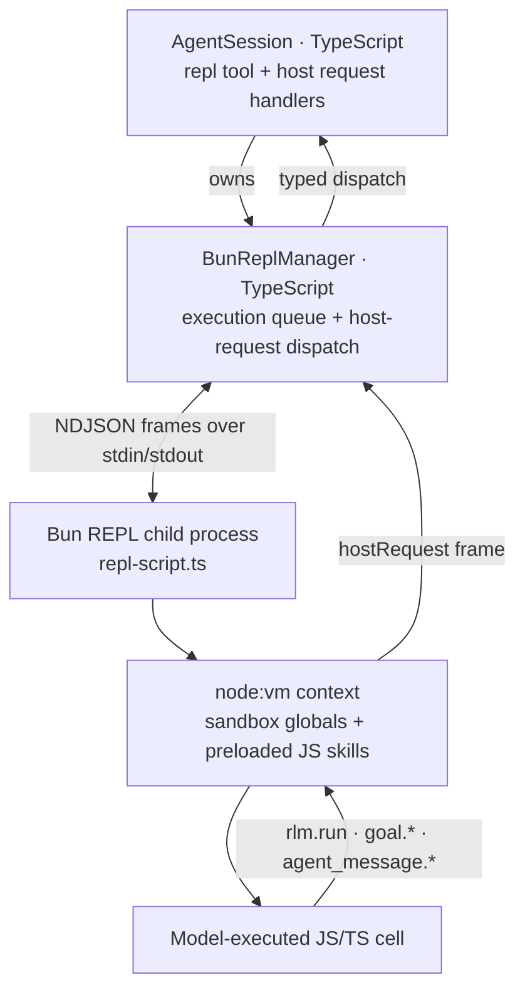
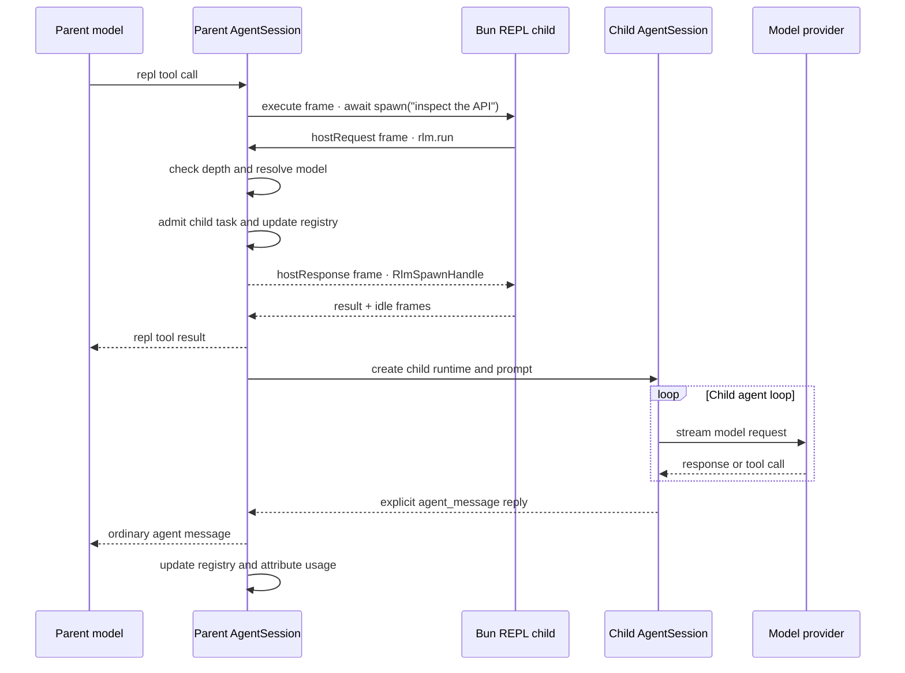

# RLM Runtime Architecture

Optimus Prime gives each agent session a persistent JavaScript/TypeScript REPL running in a Bun child process, plus a native recursive sub-agent interface. The sandbox `rlm` object is a model-facing shim; the TypeScript host owns child execution, persistence, usage accounting, and lifecycle.

The agent tool is named `repl`. Cells are JavaScript/TypeScript; there is no IPython, Jupyter, or Python involved.

## Architecture



When the model delegates work:

```js
const handle = await spawn("inspect the API", { name: "api-reviewer" });
console.log(handle.rlm_child_id, handle.name, handle.session_dir, handle.model);
```

the call is serialized as a `hostRequest` frame on the child's stdout. `BunReplManager` dispatches request type `rlm.run` to the parent `AgentSession`, which starts a child through the same TypeScript agent machinery as the parent. The response frame is written back to the child's stdin immediately after task admission and resolves the awaited promise with a child handle; it never waits for or returns the child's answer. Results arrive only through explicit `agent_message` replies or files.

The same bridge carries every other typed host request. Bundled JS skills such as `goal` call `hostRequest("goal.get", …)` through their skill context; state and policy remain in the TypeScript host.

## Delegation Flow



## Component Ownership

| Component | Responsibility |
|---|---|
| `src/core/bun-repl/index.ts` | `BunReplManager`: spawns the Bun child, frames NDJSON over stdio, serializes the execution queue, dispatches host requests, enforces timeout and hard-kill, drives snapshot/restore. |
| `src/core/bun-repl/repl-script.ts` | The child process itself: sandbox globals, the persistent `node:vm` context, `%%bash` execution, `display()`, the host-request bridge, snapshot/restore/listNames, and JS skill preloading. |
| `src/core/bun-repl/protocol.ts` | The NDJSON message types in both directions. |
| `src/core/bun-repl/transform.ts` | Rewrites top-level declarations so `const`/`let`/`function`/`class` survive between cells. |
| `src/core/bun-repl/cell.ts` | Cell parsing: `%%bash` versus JS, plus the `%%js` alias. |
| `src/core/bun-repl/state-snapshot.ts` | Reads and writes the JSON namespace snapshot in the session artifact directory. |
| `src/core/bun-repl/provisioner.ts` | Lazy startup, restore-on-first-start, and disposal of the manager. |
| `src/core/bun-repl/tool.ts` | The `repl` agent tool wrapper: parameter schema, output shaping, image attachments. |
| `src/core/agent-session.ts` | RLM policy, child creation, registry, usage attribution, cancellation, goal handlers, and REPL environment (including `OPTIMUS_REPL_SKILLS`). |
| `src/core/rlm-runtime.ts` | Typed request/spawn-handle validation for `rlm.run`, model discovery, list, and delete. |

The REPL side does not call providers or implement an agent loop.

## REPL Lifecycle

The REPL is created lazily on first `repl` use (`BunReplProvisioner.ensure()`; `prewarm()` starts it in the background). There is no runtime to bootstrap, no virtual environment, and no install step — the manager spawns `bun run repl-script.ts` (falling back to the compiled `repl-script.js` when running from `dist/`) with the session's cwd and environment.

The child boots in this order:

1. Build the `node:vm` context and populate it with the sandbox globals.
2. Preload JS skills listed in `OPTIMUS_REPL_SKILLS` (see [JS Skill Preloading](#js-skill-preloading)).
3. Emit `{"id":"ready","type":"idle"}`, which resolves the manager's start promise.

If the session artifact directory holds a snapshot, the provisioner restores it right after start and reports the revived names.

The manager owns the child process, the pending-request table, and the single-slot execution queue. `shutdown()` sends a `shutdown` frame, waits up to 5 s for exit, then `SIGKILL`s; `dispose()` flushes a final snapshot first. A `/reload` builds a new provisioner gated on the old one's dispose, so a session never holds two live REPLs and never restores from a snapshot the previous child is still writing.

## Stdio Transport

The manager and the child speak newline-delimited JSON over the child's stdin and stdout. There are no sockets, no ports, and no HMAC signing — the channel is the pipe pair of a process the host itself spawned.

Host to REPL:

```text
execute     run a cell (code, timeout, shellPath, commandPrefix)
interrupt   cooperative interrupt of the running cell
shutdown    exit cleanly
snapshot    serialize the namespace
restore     revive a namespace from snapshot data
listNames   list user-defined names in the namespace
hostResponse   the reply to a hostRequest frame
```

REPL to host:

```text
stdout / stderr    streamed output chunks, tagged with the execute id
result             the cell's outcome (value, error, displayData, diffs, sentAgentMessages)
idle               execution fully settled
snapshotResult / restoreResult / listNamesResult
hostRequest        a typed request for the host (rlm.run, goal.get, …)
lateSentAgentMessage   an agent message that resolved after its cell's result
```

The child's real stdout is reserved for protocol frames. `console.log` in a cell, and everything a `%%bash` cell prints, is captured and forwarded as `stdout`/`stderr` frames rather than written directly, so user output can never corrupt the NDJSON stream.

Ordinary output frames are accepted only when their `id` matches the active execution. `hostRequest` and `lateSentAgentMessage` frames are handled before that filter, because an un-awaited async task can emit them after its scheduling cell has already returned to idle.

`BunReplManager.execute()` calls are serialized through a promise queue: one REPL has one shared namespace and does not run two cells concurrently. RLM child agents still run concurrently, because each delegation is an independent host-side `AgentSession`, not a REPL cell.

## Why Host Requests Do Not Deadlock

A running cell can await task admission:

```js
const handle = await spawn("subtask");
```

The cell is executing inside an async IIFE in the `node:vm` context, so awaiting it yields the child's event loop. The child's stdin pump is an ordinary `data` listener, so it keeps reading frames while the cell is suspended: the `hostResponse` arrives, the pending-promise table resolves it, and the cell resumes. Nothing on either side blocks on a synchronous read, so no second channel is needed.

Child answers do not use this response path. `rlm.run` resolves at admission; the child's actual result arrives later through explicit `agent_message` replies or files.

## Cells

A cell is JavaScript/TypeScript by default. `%%js` on the first line is an explicit alias for that; `%%bash` on the first line routes the whole body to a shell (`bash` unless `shellPath` is configured, with `commandPrefix` prepended). Those two are the only cell magics — there are no IPython line magics, no `%%time`, no `%%capture`, and no `!command` shell escape.

JS cells support top-level `await`, and the last top-level expression is echoed as the cell's result. Top-level `const`, `let`, `var`, `function`, and `class` declarations persist between cells: `transform.ts` rewrites them into assignments on the vm context's global object, which outlives a single execution. Declarations nested inside blocks, functions, or classes keep their normal scoping.

Static `import` statements are not available inside a cell; use dynamic import instead:

```js
const { readdir } = await import("node:fs/promises");
(await readdir(".")).length;
```

### Sandbox Globals

The vm context is populated explicitly. Cells get `console`, `display()`, `spawn` (alias `rlm`), `cd(dir)`, `pwd()`, `env`, `crypto`, `Buffer`, `URL`, `URLSearchParams`, `TextEncoder`/`TextDecoder`, `atob`/`btoa`, `util.inspect`, the timer functions, `queueMicrotask`, and one binding per preloaded JS skill. Bun's own globals (`Bun.file`, `Bun.write`, `Bun.Glob`, `Bun.spawn`, `fetch`) and every `node:*` builtin are reachable as usual.

Database and storage clients are bound under the names Bun's own documentation uses: `Database`
(`bun:sqlite`), `SQL` and `sql` (Postgres, MySQL, MariaDB), `redis` and `RedisClient`, and
`S3Client`. Each is a lazy getter, so a cell that never opens a database does not pay for
constructing one, and REPL start stays around 17 ms. Each is also assignable, so a cell may shadow
the name with its own value.

There is deliberately **no `process`** in the sandbox, so model-generated code cannot exit or signal the REPL child out from under the host. Use `env` in place of `process.env`, and `cd()`/`pwd()` in place of `process.chdir()`/`process.cwd()`. `cd()` changes the child's real working directory, so JS cells and `%%bash` cells always agree on where they are, and an assignment into `env` is visible to every later `%%bash` cell.

`display({ mimeType, data })` emits a payload to the host. Image MIME types become context attachments the model can actually see; `application/vnd.optimus-prime.diff+json` renders an inline diff; agent-message receipts are surfaced on the tool result. This is the entire display surface — there is no Python-style rich display, and no matplotlib, pandas, or `rich` rendering path.

### Timeout and Runaway Cells

Every `execute` carries a timeout (120 s by default). Synchronous runaway code is bounded by the `node:vm` timeout. An async cell that never settles cannot be interrupted in-process, so the manager `SIGKILL`s the child and respawns a fresh REPL, then reports:

```text
Execution timed out and the REPL was restarted; in-memory state was reset.
```

Aborting a tool call first sends a cooperative `interrupt` frame and allows a one-second grace period before falling back to the same hard kill. On-disk snapshots survive a hard kill; in-memory state does not.

## State Snapshots

The namespace is snapshotted on a 1.5 s debounce after each successful cell, and again on dispose. `snapshotState()` walks the vm context, skipping injected globals and internals, and serializes what remains **as JSON** into the session artifact directory:

```text
manifest.json    { version, createdAt, names }
data.json        the serialized namespace
```

Restore is best-effort and lossy by construction. Plain data — strings, numbers, arrays, plain objects — comes back. **Functions, classes, closures, and live handles do not survive a snapshot/restore**, because JSON cannot carry them; helpers defined before a resume must be redefined after it. Circular references are replaced with `"[Circular]"`, and `BigInt` values become strings.

## JS Skill Preloading

A JS-backed skill is a normal markdown skill whose directory also contains `skill.js` at its root. `AgentSession` collects the loaded JS skills and passes them to the REPL child as one environment variable:

```text
OPTIMUS_REPL_SKILLS = [{ "name": "word-count", "global": "word_count", "entry": "/abs/path/skill.js" }, …]
```

This variable is **host-set, not user-set**. Setting it yourself is not a supported configuration; add skills the normal way instead.

At boot the child imports each `entry`, takes its `createSkill` named export (preferred) or default export, awaits the factory with the skill context `{ hostRequest, display, cwd, env }`, and binds the returned value into the sandbox under `global`. A module without a factory is bound as its own namespace. A skill that throws while loading is logged to stderr and skipped, so one broken skill can never stop the REPL from booting. Skills are loaded from disk at REPL start, so editing a `skill.js` takes effect on the next start; there is no install step.

Skills no longer ship CLI entry points. There is no `<skill> --help` shell command and no console scripts — a skill is called through its REPL binding. See [skills.md](skills.md) and `skills/skill-creator/references/js-skills.md` for the full contract.

## Sandbox RLM API

The sandbox exposes a callable `spawn` with methods attached, and `rlm` is an exact alias bound to the same object, so all of these are equivalent:

```js
await spawn("subtask");
await rlm("subtask");
await rlm.run("subtask");
```

The full surface is:

```text
spawn(prompt, kwargs?)
spawn.run(prompt, kwargs?)
spawn.find_models(query)
spawn.list_subagents()
spawn.delete_subagent(id)
spawn.host_request(requestType, payload)
```

Every one of them is async. The spawn handle returned by `spawn.run` carries `rlm_child_id`, `name`, `session_dir`, and `model`. It confirms admission only and never contains the child's answer.

Supported `spawn` options are:

- `name`: a unique readable child session name;
- `model`: an exact `provider/model` selector from `spawn.find_models()`;
- `effort`: the child's reasoning level, clamped to what its model supports; and
- `peers`: the sibling names this child may message. Edges are one-way, so listing `b` in `a`'s
  peers does not let `b` reach `a`. `[]` means it reports only to its parent. Omitting the option
  leaves the family default in place, where every sibling is reachable. The parent is always
  reachable regardless.

Unknown options fail instead of being ignored. Model search is bounded to active, non-expired credentials. If an exact selection is unavailable or fails auth preflight, spawn fails instead of silently falling back to another model. A child otherwise inherits the parent model.

`rlm.host_request()` is the raw bridge, and is what JS skills use through their `hostRequest` context field. Which request types are registered depends on session configuration: `rlm.*` and `model.info` always, plus `goal.*`, `compact.*`, `refine.*`, `rlm_heartbeat.*`, `agent_message.*`, `agent_observe.*`, and the MCP handlers when those features are enabled.

## Child Execution

`AgentSession.runRlmChild()` performs the following sequence:

1. Check `RLM_DEPTH < RLM_MAX_DEPTH`.
2. Resolve the requested model or inherit the parent model.
3. Create a `sub-xxxxxxxx` child directory under the parent artifact directory.
4. Admit the task into the parent registry and return its `RlmSpawnHandle`.
5. In detached work, create a child `SessionManager`, `Agent`, and `AgentSession`.
6. Reuse provider hooks, resource loader, model registry, tools, transport, retry settings, and thinking configuration.
7. Run the child prompt, retain its session, and update lifecycle state independently of the admission call.
8. Attribute child usage to the parent assistant turn and persist the attribution.

Children receive incremented `RLM_DEPTH`, the inherited maximum depth, and their own `RLM_SESSION_DIR`. The default maximum depth is 1, so root sessions may create children and those children may not create grandchildren unless the limit is configured higher.

## Independent Delegation

Each direct call admits an independent child and returns its handle immediately:

```js
const apiReview = await spawn("review the API", { name: "api-reviewer" });
const testReview = await spawn("review the tests", { name: "test-reviewer" });
const audit = await spawn("slow independent audit", { name: "audit-reviewer" });
```

End the turn instead of waiting for completion. Children send requested answers with `await agent_message.send(message, { receiver_role: "parent" })`, and replies arrive as ordinary agent messages over later turns. A child may instead write results to files for the parent to read. The host runs each admitted child as an independent `AgentSession`; daemon-backed children can be retained as independently addressable session workers.

## Parent-Scoped Sub-Agent Registry

The TypeScript parent maintains the authoritative direct-child registry. `await rlm.list_subagents()` returns stable child IDs, active-session IDs when daemon-backed, session IDs, names, directories, and running/completed status.

This registry survives REPL restart, compaction, and parent restore — it lives in the host, not in the REPL namespace, so even a hard-killed REPL loses nothing from it. Successfully completed daemon-backed children are rehydrated from the parent artifact registry. Inline children remain inspectable in the current process but have no active-session ID.

The parent can continue a retained daemon child with `await agent_message.send(message, { receiver_role: "child", receiver_name: child.session_name })`. Each `rlm.list_subagents()` entry carries `tokens_spent`, read from the usage the harness already
attributes per child, so a cohort's cost can be itemised rather than only totalled.

`rlm.delete_subagent()` accepts an exact child ID, active-session ID, session ID, or unique name. Deletion cancels or closes the runtime, writes a durable tombstone, and removes the child from messaging and observation. It does not erase the transcript or artifacts on disk.

Registry scope follows the parent transcript. An unrelated new parent session does not inherit children.

## Usage and Cost Attribution

The admission handle does not contain usage or completion data. Optimus Prime asynchronously folds the child's assistant usage and cost into the parent assistant turn that launched it.

The parent transcript persists a `child_usage_attributed` entry containing:

- the target parent assistant message ID;
- the child usage being attributed; and
- the resulting aggregate usage.

On reload, the aggregate is reapplied to the parent message. Context-tree reporting subtracts attributed child usage when showing each node's own usage, so tree-wide own usage and root aggregate totals remain reconcilable. Child work increases billable session totals but does not inflate the parent model's context-window measurement.

## Continual Harness State

The continual harness is a persisted state ledger for prompt notes, memories, reusable skill descriptions, sub-agent specifications, and refinement events. It is not a second execution engine.

It is owned entirely by the TypeScript host (`src/core/refinement/`). The REPL never touches the store directly, but it does reach it: `rlm.harness` forwards every call as a `harness.*` host request, which is how memories are searched and entries are written. Refinement runs go through the `refine` skill's `refine.run` and `refine.status`, and the user reaches it through `/refine`.

Session-local state lives in the session artifact directory under `harness/harness_state.json`. Explicitly global entries live under `~/.optimus/agent/harness/`.

`/refine` runs a dedicated review over the current trajectory and applies small create/update/delete edits. Rollback uses recorded before/after snapshots. The base system prompt remains immutable; refinements are supplemental state.

## Goal Requests

The bundled `goal` skill is a thin host-bridge client:

```js
await goal.get();
await goal.create("ship the release", 200000);
await goal.complete();
```

Goal state, persistence, token and wall-clock accounting, and continuation prompting live in `AgentSession`. When goals are disabled, the skill and `goal.*` host handlers are not registered.

## Session Artifacts

For a persisted root session, the relevant layout is:

```text
~/.optimus/agent/
  sessions/
    <root-session-id>.jsonl
  session-artifacts/
    <root-session-id>/
      manifest.json
      data.json
      scheduled-jobs.json
      harness/
        harness_state.json
      sub-xxxxxxxx/
        <child-session-id>.jsonl
        sub-yyyyyyyy/
```

`manifest.json` and `data.json` are the REPL namespace snapshot. Exact artifact files are created only when their features are used. Non-persistent sessions place RLM directories under the OS temporary directory and do not gain revivable session artifacts.

## Trust Boundary

The REPL executes model-generated JavaScript and `%%bash` cells with the worker's OS permissions. Running it as a separate Bun process buys lifecycle isolation and a reliable hard kill; **it is not a security sandbox**. Withholding `process` stops an accidental `process.exit()` from taking down the REPL, but a cell can still reach the filesystem, the network, and arbitrary subprocesses through `%%bash`, `Bun.spawn`, or a `node:child_process` import. Installed packages, skills, and extensions are trusted code. Use an external sandbox or restricted execution environment when the workspace or generated code is untrusted.

Provider credentials are resolved by the TypeScript host. The bounded model catalog crosses into the REPL as metadata; the full auth store does not.

## Failure Modes

| Failure | Behavior |
|---|---|
| `bun` is not on PATH | The child fails to spawn; the tool reports a REPL start error. Bun is a hard requirement — there is no fallback interpreter. |
| A JS skill throws while loading | The child logs it on stderr and skips that binding; the REPL still boots and every other skill still loads. |
| Cell exceeds its timeout | The child is `SIGKILL`ed and respawned; the cell reports the reset and in-memory state is lost. |
| REPL child exits unexpectedly | Pending requests reject; the next `execute` transparently restarts the REPL and restores the last snapshot. |
| Snapshot cannot serialize a value | That name is dropped from the snapshot rather than failing the cell; functions and closures are always dropped. |
| Depth limit reached | The host rejects `rlm.run` before creating a child. |
| Unsupported `rlm.run` options | Host rejects the request instead of ignoring the option. |
| Requested model unavailable | Spawn fails instead of substituting another model. |
| Child cancellation | Host aborts the child and removes failed/cancelled registry entries. |
| Parent teardown | Active descendants are cancelled and their runtimes are closed. |

## Focused Validation

From the repository root, the implementation is covered by focused REPL, recursion, context-tree, and daemon RLM tests. When changing cell parsing, the top-level transform, or snapshot/restore, include `bun-repl.test.ts`; when changing child creation or accounting, include `rlm-ledger.test.ts` and `context-tree.test.ts`; when changing daemon retention or sub-agent surfacing, include `acp-rlm-subagents.test.ts` and the daemon RLM lifecycle tests.
