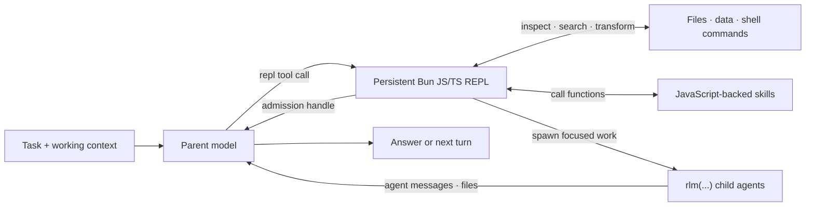

# RLM Programming Model

Optimus Prime is built around a recursive language model (RLM) runtime: the model works inside a persistent JavaScript/TypeScript control environment and composes capabilities as code. Provider calls, session persistence, child lifecycles, scheduling, and safety policy remain in the TypeScript host; the persistent Bun REPL is the model-facing programming surface.

## RLM Loop



The parent keeps its own context focused while the REPL holds working state and child agents receive only the context needed for their subtasks.

## Core Invariants

### 1. Execution is programmatic

The default RLM runtime exposes one built-in model tool: `repl`. It executes JavaScript/TypeScript in a persistent Bun REPL. Reading and editing files, running project commands, transforming results, invoking skills, and delegating work all begin from that REPL instead of separate built-in tool calls.

A cell is JS/TS with top-level `await`, and its last top-level expression is echoed as the cell result. Top-level `const`, `let`, `var`, `function`, and `class` declarations persist across cells, so variables, parsed results, and task handles remain available on later turns:

```js
const glob = new Bun.Glob("**/*.toml");
const configFiles = await Array.fromAsync(glob.scan("."));
const largeFiles = configFiles.filter((path) => Bun.file(path).size > 10_000);
largeFiles;
```

Modules load with dynamic import, because static `import` statements are not available inside a cell:

```js
const fs = await import("node:fs/promises");
const pkg = JSON.parse(await fs.readFile("package.json", "utf8"));
pkg.name;
```

Run a project's normal commands through its own environment from a `%%bash` cell:

```bash
%%bash
bun run check
```

`%%bash` and `%%js` are the only cell magics; there is no `%%time`, no `%%capture`, no `!command`, and no line magics. Each `%%bash` cell is a temporary subshell, while JavaScript state and `cd(dir)` changes persist in the REPL. Optimus Prime extensions may intentionally add custom tools, but the built-in RLM design does not require a separate model tool for every capability.

The sandbox deliberately has no `process`, so a cell cannot kill the REPL child: use `env` instead of `process.env`, and `cd()` / `pwd()` instead of `process.chdir()` / `process.cwd()`. `Bun.*`, `fetch`, `console`, `display()`, `crypto`, `Buffer`, and the timer functions are available, and every JavaScript-backed skill is bound under its own name.

### 2. Subagents are native RLM calls

The callable `rlm` object is preloaded in the REPL. Spawn a child with a direct call:

```js
const handle = await rlm("Review the authentication flow for security issues", { name: "auth-reviewer" });
console.log(handle.rlm_child_id, handle.name, handle.session_dir, handle.model);
```

`rlm(prompt, kwargs)` and `rlm.run(prompt, kwargs)` are the same call. The call returns immediately after task admission with a child handle; it never waits for or returns the child's answer. The TypeScript host creates a normal child `AgentSession` with an independent context and session directory. The child inherits the parent model, provider configuration, skills, tools, retry policy, and resource loader unless the call passes another configured model as `{ model: "..." }`.

Spawn independent children in separate calls and end the turn instead of awaiting completion:

```js
const apiReview = await rlm("Review the public API", { name: "api-reviewer" });
const testReview = await rlm("Review the test coverage", { name: "test-reviewer" });
const integrationAudit = await rlm("Run the slow integration audit", { name: "integration-audit" });
```

Results arrive only through explicit `agent_message` replies or files, never as an `rlm()` return value. Children reply when an answer is needed:

```js
await agent_message.send(message, { receiver_role: "parent" });
```

The parent can follow up with a retained child:

```js
await agent_message.send("Check the newly added regression test.", {
  receiver_role: "child",
  receiver_name: apiReview.name,
});
```

#### Child handles and lifecycle

An admission handle contains the snake_case fields `rlm_child_id`, `name`, `session_dir`, and `model`. Child usage is attributed to the parent session while remaining distinguishable in context-tree reporting.

The parent-scoped child registry survives compaction, REPL restart, and parent restoration:

```js
const { subagents } = await rlm.list_subagents();
for (const child of subagents) {
  console.log(child.session_name, child.status, child.active_session_id);
}
```

Successfully completed daemon-backed children remain addressable while their parent session is open. Delete a child only when its context is no longer needed:

```js
await rlm.delete_subagent(subagents[0].rlm_child_id);
```

The default recursion depth allows a root agent to create children. Raising the configured depth allows descendants to recurse further.

### 3. Skills add programmatic capability

Optimus Prime supports the Agent Skills markdown format and extends it with JavaScript-backed skills. Both use `SKILL.md` for discovery, routing, and instructions. A JavaScript-backed skill also contains a `skill.js` (or `skill.mjs` / `skill.ts`) at its directory root: an ES module exporting a `createSkill(ctx)` factory, whose return value the host binds into the REPL under the skill name with `-` replaced by `_`.

For a skill named `release-audit` whose factory returns a callable, the model can call:

```js
const report = await release_audit({ repository: ".", target_version: "0.4.0" });
```

Read the skill's own `SKILL.md` for its exact call shape; the binding is whatever the factory returns, so a skill may also expose an object of methods instead of a single function.

This makes JavaScript-backed skills a superset of instruction-only skills: they can provide guidance, scripts, references, typed callables, and their own module dependencies. They may also call `rlm(...)` themselves when a capability needs recursive delegation. Skills no longer ship CLI entry points, so there is no `<skill> --help` shell command and no install step; editing `skill.js` takes effect on the next REPL start.

Only skill metadata is placed in the startup prompt. The agent loads the full `SKILL.md` when the task matches, then inspects and calls the documented JavaScript API. See [Skills](skills.md) for discovery, packaging, and the built-in skill-creation workflow.

### 4. State is designed to outlive one turn

The RLM programming model assumes useful work may take many turns or continue after the terminal UI closes:

- automatic compaction summarizes older context while preserving recent messages and REPL state;
- daemon-backed workers keep active sessions running after clients detach;
- child registries and session artifacts make subagents recoverable;
- heartbeats and scheduled prompts re-enter a session later;
- persistent goals continue until the objective is complete or the user changes their state; and
- autonomous mode adds bounded continuations and optional quality gates.

REPL state persistence is best effort: the namespace is snapshotted as JSON into the session artifact directory shortly after each cell and on shutdown, then restored on resume. Plain data survives; functions, classes, closures, and live handles do not. Write anything that must outlive a session to a file.

See [Long-Running and Background Agents](long-running-agents.md) for these lifecycle features.

## Host Bridge

JavaScript skills use typed host requests for capabilities whose authoritative state belongs outside the REPL. For example, the `goal`, `agent_message`, and `compact` skills call the host through their skill context (`ctx.hostRequest(type, payload)`, the same channel as `rlm.host_request(type, payload)`); the TypeScript host validates the request and owns the state transition. Harness state is host-owned as well: there is no REPL-side harness object, and `/refine` and the `refine` skill are the interface to it.

This keeps credentials, provider execution, transcript writes, worker routing, and scheduling out of the REPL while retaining a programmatic model interface.

## Trust Model

The Bun REPL runs model-generated JavaScript and project commands with the worker's operating-system permissions. It is a durable control environment, not a security sandbox. Review third-party JavaScript skills and use an external sandbox or restricted environment for untrusted repositories and instructions.

For implementation details, see [RLM Runtime Architecture](rlm-runtime.md).
